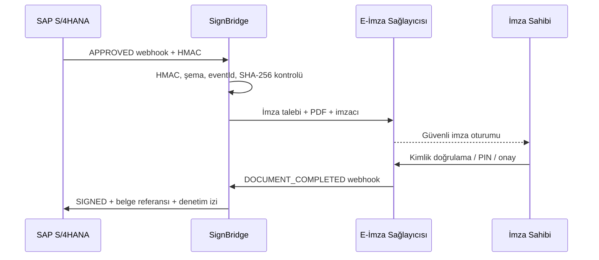

# SignBridge — SAP × E‑İmza

SAP onay süreçleri ile güvenli e‑imza sağlayıcıları arasında çalışan, olay tabanlı bir entegrasyon köprüsü. SAP tarafında bir onay `APPROVED` olduğunda imza talebi otomatik açılır; kullanıcı imzasını güvenli sağlayıcıda tamamladıktan sonra imzalı belge, durum ve denetim izi SAP’ye geri işlenir.

> Bu proje çalışan bir entegrasyon MVP’si ve demo arayüzüdür. Nitelikli elektronik imza üretmez; özel anahtar/PIN saklamaz. Gerçek imza, yetkili e‑imza sağlayıcısının güvenli aracı üzerinde kullanıcı iradesiyle oluşturulmalıdır.

## Neler hazır?

- SAP webhook’u için SHA‑256 HMAC doğrulaması
- Aynı onayın iki kez imzaya gitmesini önleyen `eventId` idempotency kontrolü
- Değiştirilebilir imza sağlayıcı adaptörü (`demo`, `documenso`)
- Documenso v2 `envelope/create` + `envelope/distribute` entegrasyonu
- Documenso `DOCUMENT_COMPLETED` webhook’u ve sabit zamanlı secret karşılaştırması
- İmza tamamlanınca SAP’ye geri bildirim
- Süreç başına okunabilir denetim izi
- SSRF’e karşı belge sunucusu izin listesi
- Bağımlılıksız Node.js sunucusu, mobil uyumlu demo paneli ve testler

## Akış



## Hızlı başlatma

Node.js 20+ yeterlidir; harici paket kurulumu yoktur.

```powershell
Copy-Item .env.example .env
node src/server.js
```

Arayüz: `http://localhost:8787`

Testler:

```powershell
node --test
```

## SAP webhook sözleşmesi

`POST /api/webhooks/sap/approval`

```json
{
  "eventId": "sap-event-2026-00091",
  "approvalId": "APR-700191",
  "system": "SAP S/4HANA Cloud",
  "status": "APPROVED",
  "approvedAt": "2026-08-20T08:30:00Z",
  "document": {
    "id": "PO-45000931",
    "title": "Yatırım Harcama Onayı",
    "hash": "sha256:cf71351b12b7e6e4782892d5f6d0e0c1bb0237a47f867f61de2d1e0899a100cd",
    "url": "https://documents.example.com/sap/PO-45000931.pdf"
  },
  "signer": {
    "name": "Selin Aras",
    "email": "selin.aras@example.com",
    "department": "Finans"
  }
}
```

Header:

```text
X-SAP-Signature: sha256=<HMAC_SHA256(raw_body, SAP_WEBHOOK_SECRET)>
```

Ayrıntılar: [docs/SAP_INTEGRATION.md](docs/SAP_INTEGRATION.md)

## Documenso’ya bağlama

1. `.env` içinde `SIGNATURE_PROVIDER=documenso` yapın.
2. `DOCUMENSO_API_URL`, `DOCUMENSO_API_KEY` ve `DOCUMENSO_WEBHOOK_SECRET` değerlerini girin.
3. SAP PDF sunucusunu `DOCUMENT_HOST_ALLOWLIST` listesine ekleyin.
4. Documenso takım ayarlarında webhook URL’sini `https://<bridge>/api/webhooks/documenso` olarak tanımlayın.
5. Yalnızca gerekli olayları, özellikle `DOCUMENT_COMPLETED`, seçin.

Documenso kişisel hesaplarında webhook kullanılamayabilir; takım özelliği gerekir. Üretim öncesinde kullandığınız sürümü güvenlik danışmanları ve lisans koşulları açısından ayrıca değerlendirin.

## Üretim kontrol listesi

- HTTPS/mTLS veya SAP BTP Destination kullanın.
- Secret değerlerini Vault/KMS’de tutun ve düzenli döndürün.
- Demo içi bellek deposunu PostgreSQL/HANA tabanlı dayanıklı bir outbox/idempotency tablosuyla değiştirin.
- PDF URL’lerini kısa ömürlü, tek kullanımlık ve host allowlist ile sınırlı yapın.
- Kuyruk, retry/backoff ve dead-letter queue ekleyin.
- İmzalı belgeyi indirdikten sonra PAdES/XAdES validasyonu, sertifika zinciri, OCSP/CRL ve zaman damgası kontrolü yapın.
- Kişisel nitelikli e‑imza için kullanıcı iradesini/PIN adımını atlamayın. Tam otomasyon gereken senaryolarda kişisel imza yerine mevzuata uygun kurumsal elektronik mühür/HSM politikasını hukuk ve güvenlik ekipleriyle değerlendirin.

## Açık kaynak altyapı seçenekleri

Karşılaştırma ve önerilen rol dağılımı: [docs/GITHUB_E_SIGNATURE_OPTIONS.md](docs/GITHUB_E_SIGNATURE_OPTIONS.md)

- [Documenso](https://github.com/documenso/documenso) — self-hosted belge imzalama iş akışı ve API
- [LibreSign](https://github.com/LibreSign/libresign) — Nextcloud tabanlı kontrollü imza süreçleri
- [EU DSS](https://github.com/esig/dss) — PAdES/XAdES/CAdES/JAdES üretim, genişletme ve doğrulama kütüphanesi

## LinkedIn paylaşımı

Hazır metin: [docs/LINKEDIN_POST_TR.md](docs/LINKEDIN_POST_TR.md)

## Lisans

SignBridge örnek kodu MIT lisanslıdır. Entegre edeceğiniz üçüncü taraf projelerin (ör. AGPL/LGPL) lisanslarını ayrıca inceleyin.

