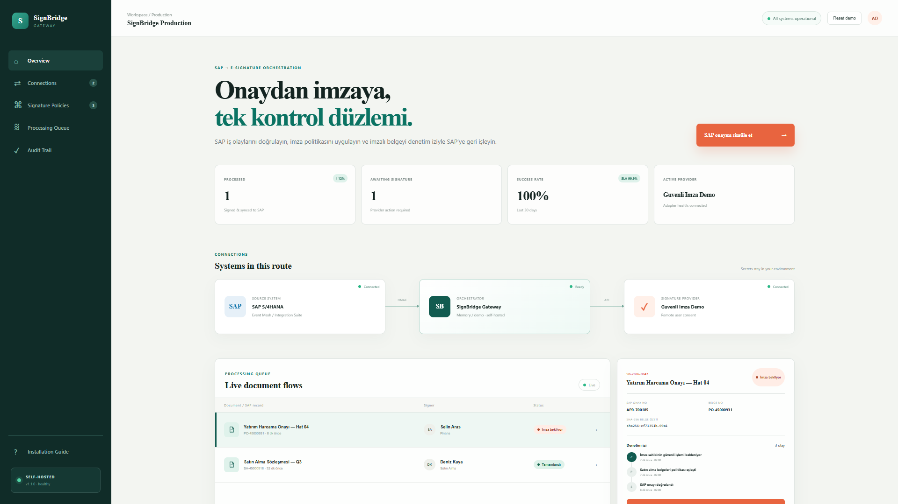

# SignBridge Gateway

**SAP onaylarını, kurumun seçtiği e‑imza sağlayıcısına bağlayan self-hosted orkestrasyon katmanı.**

SignBridge bir imza uygulaması veya sertifika sağlayıcısı değildir. SAP’ten gelen onay olayını doğrular, belge ve şirket politikasını uygular, kullanıcıyı yapılandırılmış imza sağlayıcısına yönlendirir ve imzalı sonucu denetim iziyle SAP’ye geri işler. Özel anahtar ve PIN gateway'e girmez.



## Ürün yüzeyi

- SAP S/4HANA Cloud veya on-prem kaynak sistem
- Event Mesh / Integration Suite üzerinden asenkron olay alımı
- HMAC doğrulama ve `eventId` tabanlı idempotency
- Belge türü + şirket kodu tabanlı imza politikaları
- Documenso adaptörü ve yeni sağlayıcılar için adaptör arayüzü
- PostgreSQL üzerinde kalıcı iş, retry ve audit kaydı
- SAP geri bildirim hataları için yeniden deneme uç noktası
- Yönetim konsolu, health ve readiness kontrolleri
- Docker Compose ile kurum içinde kurulum

## Mimari

```text
SAP S/4HANA
    │ Business Event / approval exit
    ▼
SAP Event Mesh → Integration Suite iFlow
    │ HTTPS + HMAC
    ▼
SignBridge Gateway ─── PostgreSQL
    │ provider adapter
    ▼
E‑İmza sağlayıcısı
    │ completion webhook
    ▼
SignBridge → SAP OData/HTTP → DMS / iş nesnesi / audit
```

## Beş dakikalık yerel başlangıç

Demo, harici bağımlılık olmadan çalışır:

```bash
pnpm install
cp .env.example .env
pnpm start
```

Ardından `http://localhost:8787` adresini açın. Kalıcı kurulum:

```bash
cp .env.example .env
# .env içindeki secret ve URL değerlerini değiştirin
export POSTGRES_PASSWORD='uzun-rastgele-bir-parola'
docker compose up -d --build
curl --fail http://127.0.0.1:8787/api/ready
```

Reverse proxy üzerinde TLS sonlandırın; `8787` portunu internete doğrudan açmayın.

## SAP kurulumu

S/4HANA Cloud, on-prem ve geri dönüş akışlarını kapsayan adım adım rehber:

**[SAP Kurulum Tutorialı](docs/SAP_INSTALLATION_TUTORIAL_TR.md)**

Kısa entegrasyon sözleşmesi ve örnek payload için [SAP entegrasyon notlarına](docs/SAP_INTEGRATION.md), uç noktalar için [OpenAPI tanımına](openapi.yaml) bakın.

## Temel ortam değişkenleri

| Değişken | Açıklama |
|---|---|
| `DATABASE_URL` | PostgreSQL bağlantı dizesi; boşsa yalnızca demo memory store kullanılır |
| `SAP_WEBHOOK_SECRET` | SAP/iFlow ile paylaşılan HMAC secret |
| `SAP_UPDATE_URL` | İmza tamamlandığında çağrılacak SAP/iFlow endpoint'i |
| `SIGNATURE_PROVIDER` | `demo` veya `documenso` |
| `DOCUMENT_HOST_ALLOWLIST` | PDF indirilebilecek SAP/DMS hostları |
| `ADMIN_TOKEN` | Operasyonel write endpoint'leri için bearer token |
| `SEED_DEMO` | Production'da `false` olmalı |

Tüm seçenekler için [.env.example](.env.example) dosyasını kullanın.

## API akışı

```bash
BODY='{"eventId":"evt-100","approvalId":"APR-100","companyCode":"1000","status":"APPROVED","document":{"id":"DOC-100","title":"Tedarikçi Sözleşmesi","type":"CONTRACT","hash":"sha256:...","url":"https://sap.example.com/DOC-100.pdf"},"signer":{"name":"Ali Özer","email":"ali@example.com","department":"Hukuk"}}'
SIGNATURE="sha256=$(printf '%s' "$BODY" | openssl dgst -sha256 -hmac "$SAP_WEBHOOK_SECRET" -hex | sed 's/^.* //')"
curl -X POST http://localhost:8787/api/webhooks/sap/approval \
  -H 'Content-Type: application/json' \
  -H "X-SAP-Signature: $SIGNATURE" \
  --data "$BODY"
```

## Güvenlik sınırı

Production kurulumu için en azından TLS, secret manager, outbound allowlist, PostgreSQL yedekleme, merkezi log/SIEM ve sağlayıcı webhook doğrulaması kullanın. Nitelikli e‑imza mevzuatı ve sağlayıcı seçimi ülkeye ve belge türüne göre değerlendirilmelidir; bu repo hukuki uygunluk garantisi vermez.

## Geliştirme

```bash
pnpm check
docker build -t signbridge-gateway:local .
```

Yeni sağlayıcı, `createSignatureRequest(job)` metodunu uygulayan bir adaptör olarak `src/providers` altına eklenir. İş akışının geri kalanı sağlayıcıdan bağımsızdır.

## Lisans

MIT. SAP, SAP SE’nin; diğer ürün adları ilgili sahiplerinin ticari markalarıdır. Bu proje SAP tarafından desteklenen/resmî bir ürün değildir.
